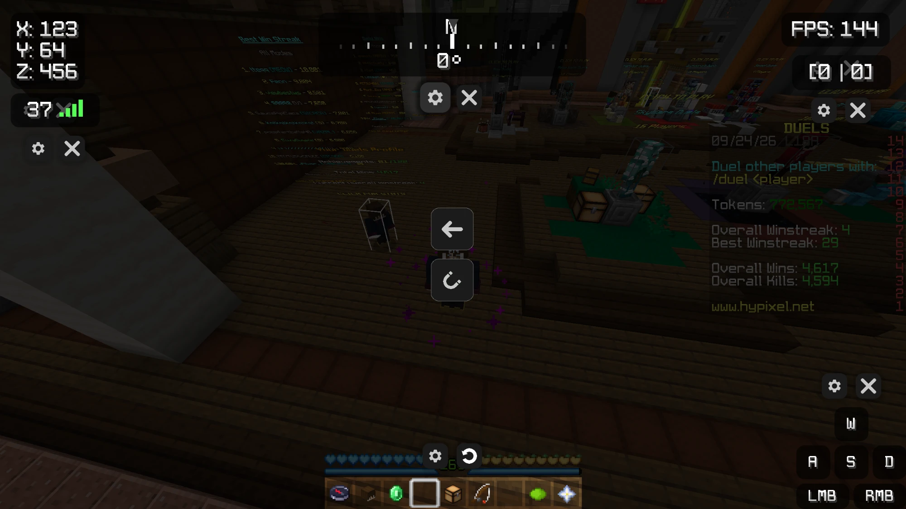

# Chimera Client

A Minecraft 1.8.9 client built on Minecraft Forge, aimed at Hypixel and Bedwars. It adds a set of
configurable HUD elements and quality-of-life mods, a custom in-game menu for configuring them, and
a desktop launcher.

**This is not a hack client.** Every mod in it changes what you see, not what the game does. There
is no reach extension, no aim assistance, no auto-clicking, no movement modification, and no
X-ray — nothing that alters what the server is told or gives an advantage over other players.
Features are deliberately built as render-layer changes for that reason.

## Screenshots

Dragging HUD elements around the screen. Every element can be moved, resized and configured from
here, and each has its own settings shortcut.

The main menu.

The mod list, with every mod toggleable in place and favourites pinned to the top.

Each mod has its own settings panel — this is the Armor HUD's.

In game, with hitboxes, a custom crosshair, hit damage numbers and the HUD elements in use.

## What's in it

38 mods, each with its own settings panel and most with a movable HUD element:

**Information** — FPS, ping, coordinates, speedometer, compass, reach display, CPS counter,
combo counter, armour HUD, armour durability info, health display, potion effects, item count,
keystrokes, TNT timer

**Visual** — crosshair designer, block overlay, hitboxes, lighting, particles, dropped items,
item size, damage tint, damage screen shake, hit damage numbers, view bobbing, FOV changer,
swing animation, sneak animation, weather changer, time changer, 3D skin layers

**Gameplay conveniences** — zoom, toggle sprint, inventory styling, daily reward shortcut,
Bedwars shopkeeper improvements

**Customisation** — a client theme system, per-mod colour and animation settings, and a drag and
drop screen for arranging every HUD element on screen.

## Launcher

A desktop launcher handles signing in and starting the game.

- Microsoft sign-in using the OAuth 2.0 device code flow, so sign-in happens on Microsoft's own
  page rather than inside the launcher
- Only the `XboxLive.signin` scope is requested, plus `offline_access` so players aren't asked to
  sign in on every launch
- The refresh token is stored locally, encrypted through the operating system's keystore. The
  Minecraft access token is held in memory only and never written to disk
- No account data is sent anywhere other than to Microsoft, Xbox and Minecraft's own endpoints

## Status

In active development. The client itself is working and in daily use; the launcher is partly
built, with sign-in implemented and game launching in progress.

## Built with

Minecraft Forge 1.8.9 (11.15.1.2318) for the client, Electron for the launcher.
