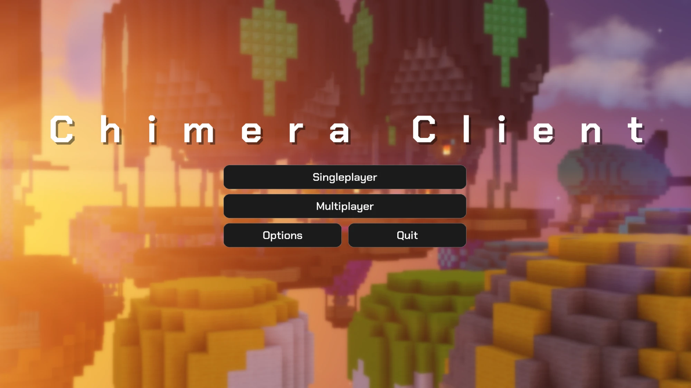
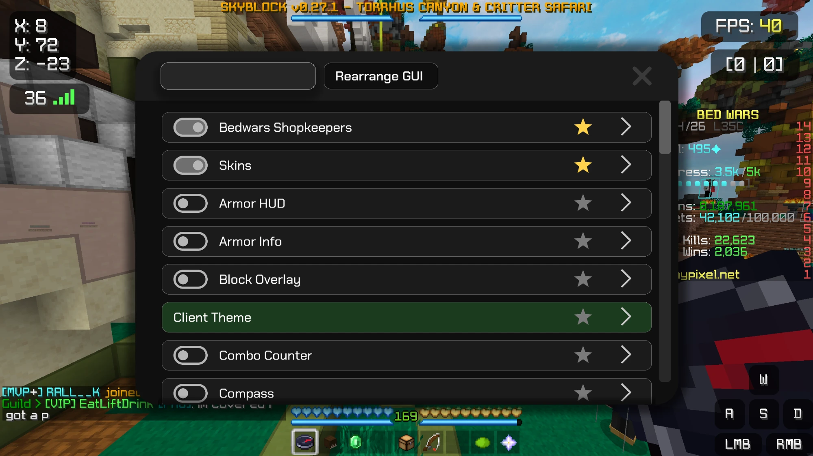
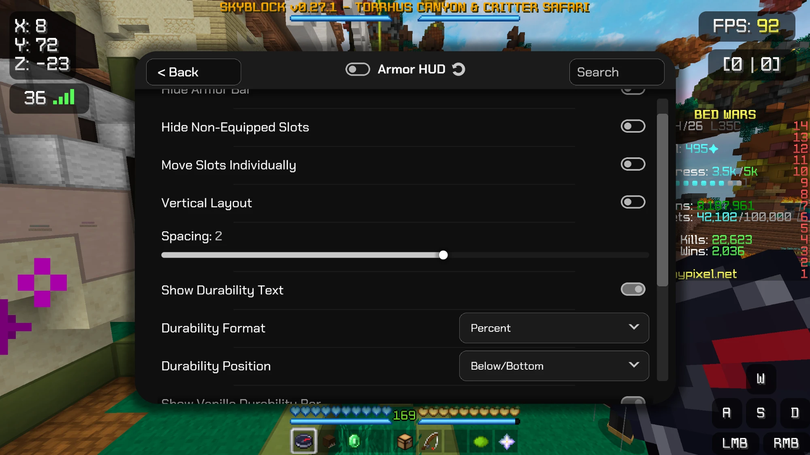
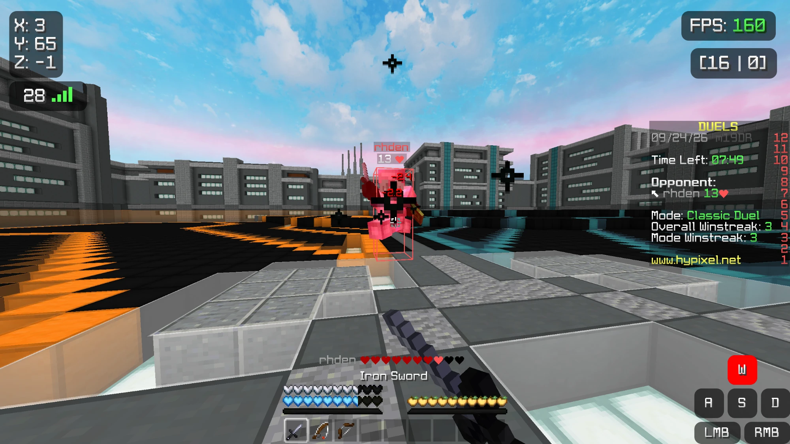

# Chimera Client

A Minecraft 1.8.9 client built on Minecraft Forge, made mainly for Hypixel and Bedwars. It adds a
set of configurable HUD elements and quality of life mods, an in-game menu for setting all of them
up, and a desktop launcher.

**This is not a hack client.** Everything in it changes what you see, not what the game does.
There's no reach extension, no aim assist, no auto clicking, no movement modification and no X-ray.
Nothing in it alters what the server is told or gives an advantage over other players. Features are
built as render layer changes for exactly that reason.

## Screenshots

The main menu.

Dragging HUD elements around the screen. Every element can be moved, resized and configured from
here, and each one has its own settings shortcut.

The mod list, with every mod toggleable in place and favourites pinned to the top.

Each mod has its own settings panel. This is the Armor HUD's.

In game, with hitboxes, a custom crosshair, hit damage numbers and the HUD elements in use.

## What's in it

Currently at 38 mods, but still in development with over 50 more planned. Current mods include FPS
display, ping display, coordinates, speedometer, reach display, CPS counter, combo counter,
keystrokes, custom crosshair, block overlay, lighting, hitboxes, particles, view bobbing, damage
tint, sneak animation, 3D skins, high resolution skins, time changer, zoom, toggle sprint, Bedwars
shopkeeper improvements, and more.

Every mod has its own settings panel, and most come with a HUD element you can drag anywhere on
screen.

## Launcher

A desktop launcher handles signing in and starting the game.

- Microsoft sign in using the OAuth 2.0 device code flow, so you sign in on Microsoft's own page
  rather than inside the launcher
- It only asks for the `XboxLive.signin` scope, plus `offline_access` so you aren't asked to sign
  in every time you open it
- The refresh token is stored locally and encrypted through the operating system keystore. The
  Minecraft access token is only ever held in memory and never written to disk
- No account data goes anywhere except Microsoft, Xbox and Minecraft's own endpoints

## Status

Still in development. The client itself works and gets used daily. The launcher is partly built,
with sign in working and game launching still to come.

## Built with

Minecraft Forge 1.8.9 (11.15.1.2318) for the client, and Electron for the launcher.
