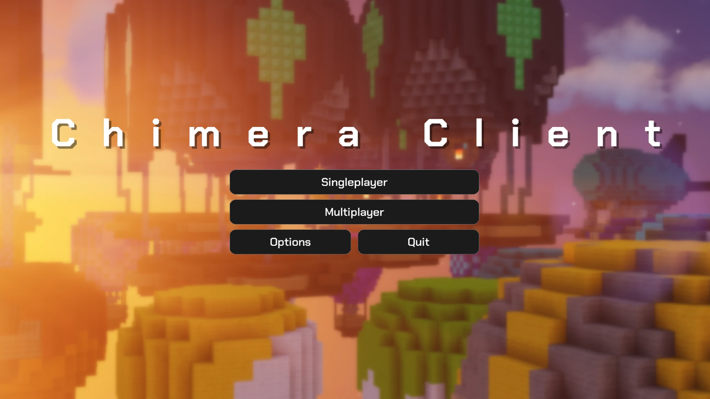
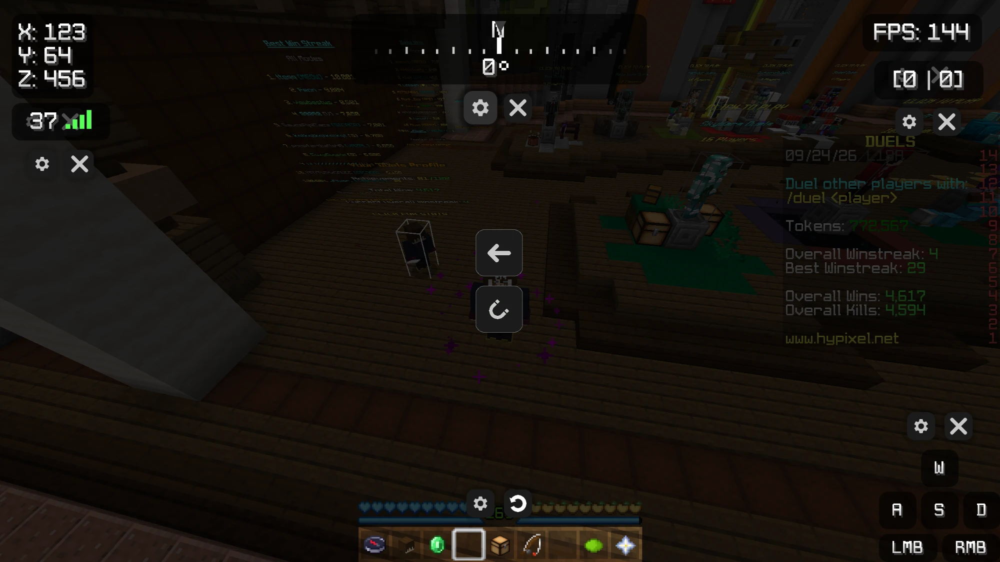
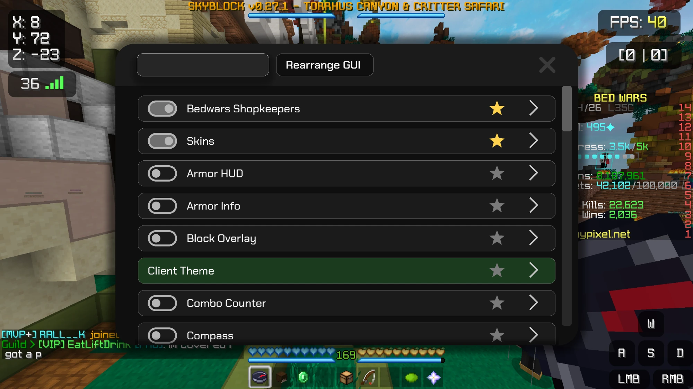
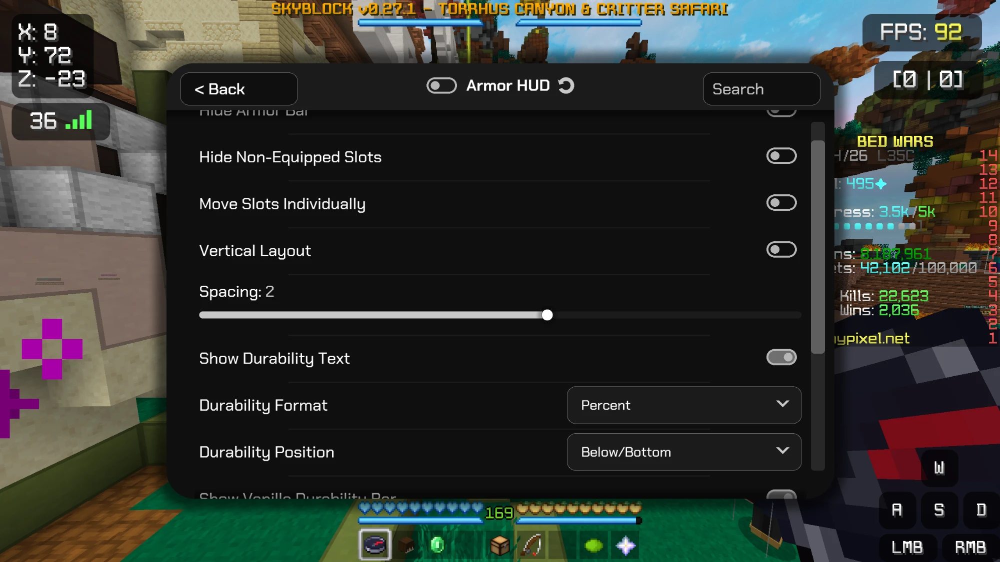
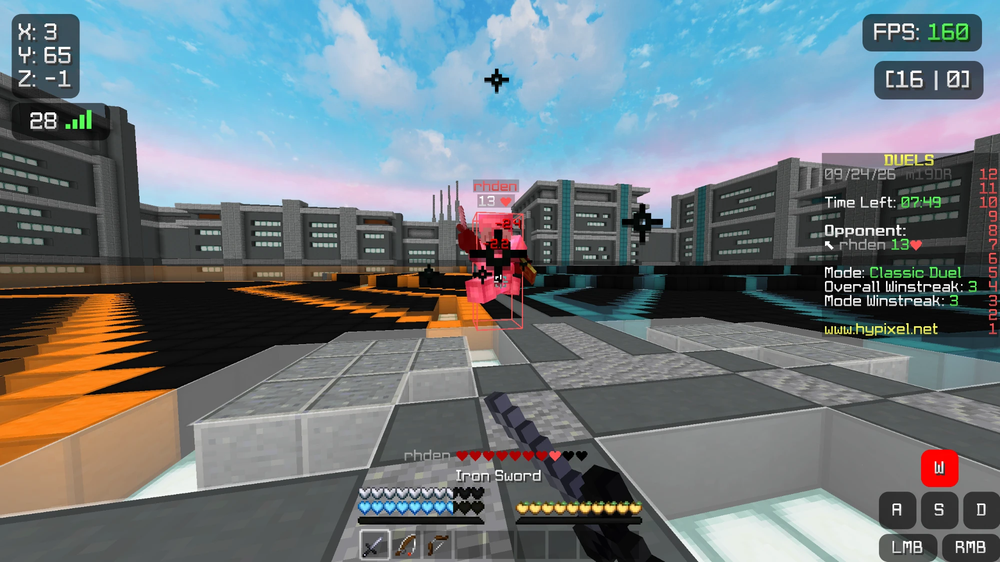

# Chimera Client

A Minecraft 1.8.9 client built on Minecraft Forge, made mainly for Hypixel Bed Wars and other
minigames. It adds a set of configurable HUD elements and quality of life mods, an in-game menu for
setting all of them up, and a desktop launcher.

**This is not a hack client.** Everything in it changes what you see, not what the game does.
There's no reach extension, no aim assist, no auto clicking, no movement modification and no X-ray.
Nothing in it alters what the server is told or gives an advantage over other players. Features are
built as render layer changes for exactly that reason.

## Screenshots

The main menu.

Dragging HUD elements around the screen. Every element can be moved, resized and configured from
here, and each one has its own settings shortcut.

The mod list, with every mod toggleable in place and favorites pinned to the top.

Each mod has its own settings panel. This is the Armor HUD's.

In game, with hitboxes, a custom crosshair, hit damage numbers and the HUD elements in use.

## What's in it

Over 50 mods so far, and still in development. Current mods include FPS display, ping display,
coordinates, CPS counter, keystrokes, custom crosshair, block overlay, hitboxes, zoom, toggle
sprint, chat improvements, nametags, enchantment glint, fog, motion blur, 3D skins, Level Head, a
Bed Wars stats overlay, Bed Wars shopkeeper improvements, and more.

Every mod has its own settings panel, and most come with a HUD element you can drag anywhere on
screen.

## Launcher

A desktop launcher handles signing in and starting the game.

- Microsoft sign in using the OAuth 2.0 device code flow, so you sign in on Microsoft's own page
  rather than inside the launcher
- It only asks for the `XboxLive.signin` scope, plus `offline_access` so you aren't asked to sign
  in every time you open it
- The refresh token is stored locally and encrypted through the operating system keystore. The
  Minecraft access token is only ever held in memory and never written to disk
- Sign in tokens never go anywhere except Microsoft, Xbox and Minecraft's own endpoints

## Chimera's server

Chimera runs a small server of its own (a Cloudflare Worker) for two things.

**Showing who uses Chimera.** The client registers your Minecraft UUID, proven with Mojang's player
certificate, so other Chimera players see a Chimera logo on your nametag. Your sign in tokens are
never sent to it.

**Hypixel stats.** Two mods use the Hypixel API:

- Level Head shows a player's Bed Wars star, FKDR or network level above their nametag
- The Stats Overlay shows Bed Wars or Duels stats for the players in your current game, in the tab
  list or an on-screen panel

The API key is stored as a secret on the server. It's never included in the client, and players
never enter a key of their own. The server only calls `/v2/player` and `/v2/guild`, caches what it
gets (player stats for 30 minutes, guilds for 24 hours), stops as soon as Hypixel's rate limit is
reached, and sends the client a small summary instead of the raw response.

## Status

Still in development and not released yet. The client and launcher both work, and the client gets
used daily through the launcher.

## Built with

Minecraft Forge 1.8.9 (11.15.1.2318) for the client, and Electron for the launcher.
